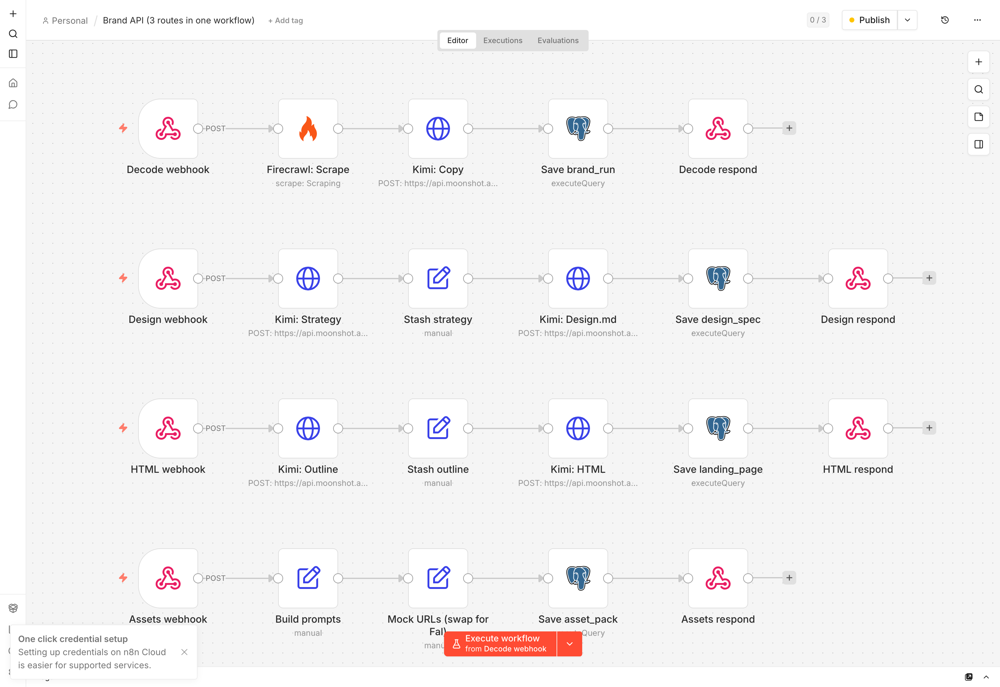
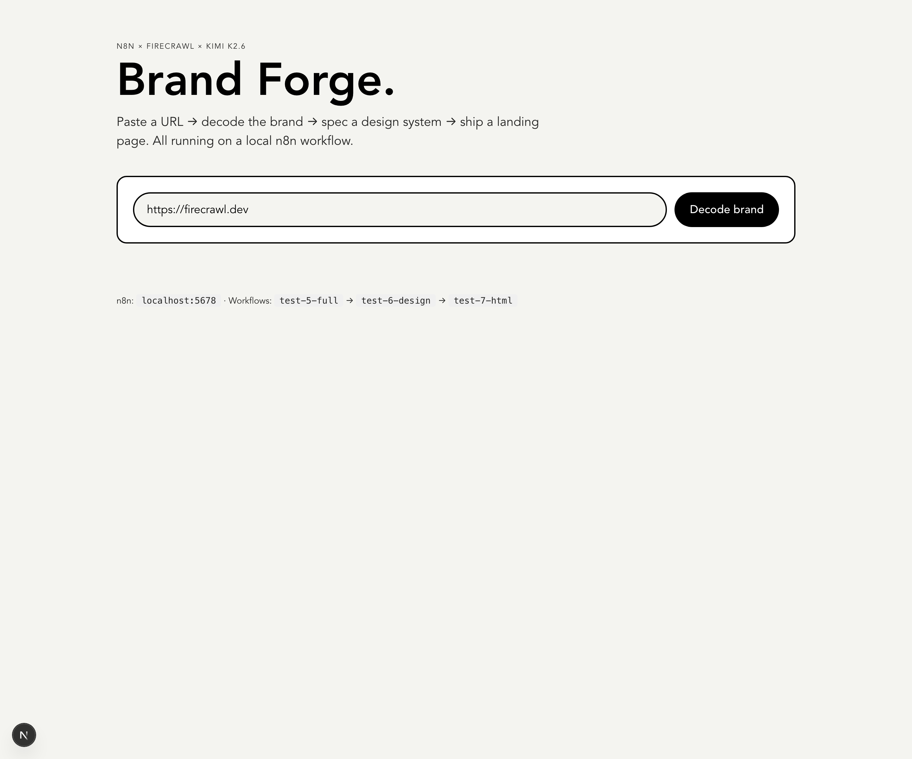

# Brand Forge — an n8n demo

Turn any URL into a brand kit, design system, marketing assets, and a production-quality landing page - powered by a single self-hosted n8n workflow with a Next.js 16 frontend.

Built to show off **n8n as a backend**: one workflow, four webhook routes, optional Neon Postgres persistence (schema in `db/`).





---

## Quickstart

```bash
git clone <repo> && cd n8n-demo
make import                          # imports the workflow into n8n
cp web/.env.example web/.env.local   # add your KIMI key (FAL goes into n8n credentials)
cd web && bun install && cd ..       # one-time
make dev                             # n8n on :5678 + web on :3000
make smoke                           # in another shell - verifies all 4 webhooks
```

Need credentials or stuck? See [Run it locally](#run-it-locally) and [Troubleshooting](#troubleshooting) below. `make help` lists every target.

## What it does

Paste a URL, get back:

1. **Brand decoded** — Firecrawl scrapes the site (markdown, summary, branding tokens, screenshot). Kimi K2.6 writes hero copy + tone in the brand's voice.
2. **Design system** — Two-step Kimi pass: strategy (archetype, positioning, voice examples) → full `design.md` spec (palette, typography, components, spacing, expansion ideas).
3. **Marketing assets** — Hero / Instagram post / OG card / IG story, all in the brand's actual colors. Generated via **Fal AI** (`fal-ai/gpt-image-2`), 4 images per run from one HTTP node iterating over prompt items.
4. **Landing page** — Outline → 8-section responsive HTML with inline CSS, rendered live in an iframe and downloadable.

A `/history` view is sketched out for showing past brand kits per mock user — currently driven by client-side state, but `db/schema.sql` is ready for when you wire up the Postgres node in n8n.

## The whole thing is one n8n workflow

`brandapi00000000000000001` — 22 nodes, 4 webhook entry points, all on one canvas:

```
POST /webhook/brand/decode  →  Firecrawl → Kimi: Copy   → Save brand_run    → Decode respond
POST /webhook/brand/design  →  Kimi: Strategy → Stash → Kimi: Design.md → Save design_spec → Design respond
POST /webhook/brand/html    →  Kimi: Outline  → Stash → Kimi: HTML       → Save landing_page → HTML respond
POST /webhook/brand/assets  →  Build prompts (4 items) → Fal: Generate → Shape → Aggregate → Assets respond
```

That's the whole backend. No Express, no Hono — just n8n + Postgres.

## Stack

- **n8n** 2.17.7 (self-hosted, SQLite for n8n's own state)
- **Firecrawl** v2 API — scrape + branding extraction (colors, fonts, logo, components, spacing)
- **Kimi K2.6** + **Kimi K2 Turbo Preview** — Moonshot's chat completions API (OpenAI-compatible)
- **Fal AI** (`fal-ai/gpt-image-2`) — 4 marketing images per run, generated in the `assets` branch
- **Neon Postgres** — schema in `db/schema.sql` for brand runs / design specs / landing pages / asset packs (persistence is opt-in; the workflow currently responds without writing — wire up the Postgres node when you want history)
- **Next.js 16** (App Router, Turbopack) — frontend wrapping the n8n webhooks
- **Tailwind 4** — DevDigest design system (cream/ink/pink, offset cards, pill buttons)

## Repo layout

```
.
├── README.md
├── workflow/
│   └── brand-api.json           # the n8n workflow export — import into your n8n
├── db/
│   └── schema.sql               # Neon Postgres schema
├── docs/
│   ├── canvas.png               # screenshot of the workflow canvas
│   └── app.png                  # screenshot of the running app
└── web/                         # Next.js app
    ├── app/
    │   ├── page.tsx             # 4-step UI
    │   ├── layout.tsx
    │   ├── globals.css          # DD design tokens
    │   └── api/
    │       ├── decode/route.ts      # → /webhook/brand/decode
    │       ├── design/route.ts      # → /webhook/brand/design
    │       ├── html/route.ts        # → /webhook/brand/html
    │       ├── assets/route.ts      # → /webhook/brand/assets (Fal images)
    │       ├── fonts/route.ts       # → /webhook/brand/fonts
    │       ├── generate/route.ts    # legacy single-shot, uses N8N_WEBHOOK_URL
    │       ├── index-css/route.ts   # Kimi-streamed brand index.css
    │       └── mini-asset/route.ts  # Kimi-streamed UI snippets in the brand system
    └── package.json
```

## Run it locally

```bash
# 1. n8n
brew install n8n            # or: npm i -g n8n
n8n start                   # localhost:5678

# 2. Install the Firecrawl community node in n8n UI:
#    Settings → Community Nodes → Install
#    @mendable/n8n-nodes-firecrawl

# 3. Import the workflow
n8n import:workflow --input=workflow/brand-api.json

# 4. Create credentials in n8n UI:
#    - Firecrawl API → your fc-... key
#    - Kimi K2.6 Header Auth → HTTP Header Auth (name: Authorization, value: Bearer sk-...) with your Moonshot key
#    - Fal Header Auth         → HTTP Header Auth (name: Authorization, value: Key <FAL_KEY>) with your Fal key
#    - Postgres                → your Neon connection details

# 5. Postgres schema
psql "$DATABASE_URL" -f db/schema.sql

# 6. Frontend
cd web
bun install
cp .env.example .env.local  # then edit: KIMI_API_KEY is required, N8N_BASE_URL only if n8n isn't on localhost:5678
bun dev                     # localhost:3000
```

> **Tip:** once everything is wired up, `make dev` from the repo root starts n8n + the web app together. `make help` lists the rest.

## Troubleshooting

**`{"error":"empty response from n8n", "upstream_status": 404}`**
The workflow isn't active or hasn't been imported. Re-run `make import` and toggle the "Active" switch in the n8n UI.

**`{"error":"KIMI_API_KEY not set"}`**
You haven't created `web/.env.local` yet — `cp web/.env.example web/.env.local` and fill in your Moonshot key.

**Fal returns 401 / 403**
The `Fal Header Auth` credential value must be `Key <FAL_KEY>` (literal word "Key" + space + your key) — *not* `Bearer ...`.

**Webhook fires but the assets array is empty**
Open the n8n execution log for the run — the `Fal: Generate` node iterates over 4 items, so a single failure shows up as a partial result. Most common cause: rate-limited or insufficient credit on Fal.

**`/history` is always empty**
By design — persistence is opt-in. Add a Postgres node after each `... respond` step in the workflow and it'll start writing to the tables in `db/schema.sql`.

## Roadmap

See [ROADMAP.md](ROADMAP.md).
Next up: streaming the HTML step via SSE so the landing page renders token-by-token in the iframe.

---

Workflow runs against:
- Firecrawl (cloud) — `api.firecrawl.dev/v2`
- Moonshot (cloud) — `api.moonshot.ai/v1`
- Fal (cloud) — `fal.run/fal-ai/gpt-image-2`
- Neon (cloud) — Postgres, optional (only if you wire up persistence)
- Everything else — local

## License

MIT - see [LICENSE](LICENSE).
