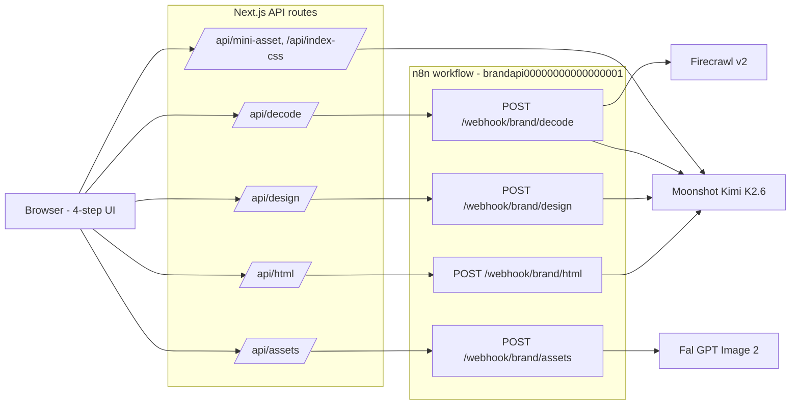

# Architecture

Open Design is a Next.js 16 frontend wrapping a single n8n workflow with four webhook entry points. The frontend proxies requests to n8n; n8n orchestrates calls to Firecrawl, Moonshot (Kimi), and Fal.

## System diagram

## Data flow per step

| Step | n8n webhook | Next.js proxy route | External services |
| --- | --- | --- | --- |
| Decode | `POST /webhook/brand/decode` | `web/app/api/decode/route.ts` | Firecrawl v2 (scrape + branding tokens), Kimi K2.6 (hero copy + tone) |
| Design | `POST /webhook/brand/design` | `web/app/api/design/route.ts` | Kimi K2.6 (strategy pass), Kimi K2 Turbo (full `design.md`) |
| HTML | `POST /webhook/brand/html` | `web/app/api/html/route.ts` | Kimi K2.6 (outline), Kimi K2 Turbo (8-section HTML) |
| Assets | `POST /webhook/brand/assets` | `web/app/api/assets/route.ts` | Fal `fal-ai/gpt-image-2` (4 images: hero, IG post, OG card, IG story) |
| Mini-asset (stream) | n/a | `web/app/api/mini-asset/route.ts` | Kimi (SSE) |
| Index CSS (stream) | n/a | `web/app/api/index-css/route.ts` | Kimi (SSE) |
| Fonts | `POST /webhook/brand/fonts` | `web/app/api/fonts/route.ts` | Kimi (font pairings) |

All n8n-bound routes go through `web/lib/n8n.ts::proxyToN8n`, which wraps fetch errors, empty bodies, and non-JSON upstream responses into actionable 502s.

## Why n8n

Visual canvas, drop-in HTTP nodes, easy to fork. Each external call (Firecrawl, Kimi, Fal) is a single configured node with credentials managed in the n8n UI - no SDK install, no key rotation in code, no retry boilerplate. The same logic in Express would be 200+ lines of fetch wrappers, error handling, prompt templating, and credential plumbing. Forking the workflow means re-importing one JSON file.

## Why one workflow vs four

`brand-api.json` is one workflow with 4 webhook entry points, not 4 separate workflows. Reasons:

- Atomic imports - one file, one toggle to activate.
- One canvas to read as a product. The 22 nodes form a coherent picture of the whole backend.
- Shared sub-graphs (the "stash + Kimi + respond" pattern) sit next to each other for visual diffing.

The routes are still independent at runtime - each webhook is its own execution, and they don't share in-memory state across requests. The frontend is responsible for passing context (`brand_run_id`, `design_md`, etc.) from one call into the next.

## State

The frontend holds everything in client-side React state across the 4 steps. There is no server session.

Persistence is opt-in. `db/schema.sql` defines tables for `brand_run`, `design_spec`, `landing_page`, and `asset_pack`, but the workflow currently responds without writing. To enable history, drop a Postgres node after each `... respond` step in the n8n canvas - the schema is shaped to match the response payloads directly.

`/history` is wired to read from those tables once they start filling up.

## Streaming

Two routes stream Server-Sent Events from Kimi directly, bypassing n8n:

- `web/app/api/mini-asset/route.ts` - generates UI snippets in the brand's design system, token-by-token.
- `web/app/api/index-css/route.ts` - generates a brand `index.css`, token-by-token.

These bypass n8n because n8n's webhook response node buffers the full response before returning - incompatible with SSE. Everything else is request/response and goes through `proxyToN8n`.

The HTML step is currently buffered (n8n returns the full document at once). Streaming it through SSE is on the roadmap.
