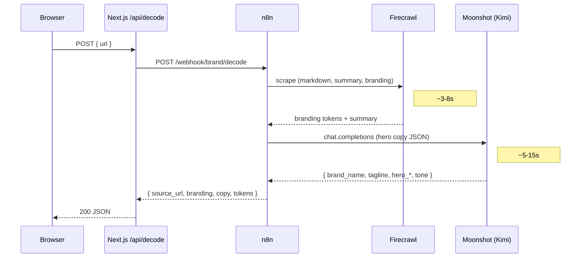
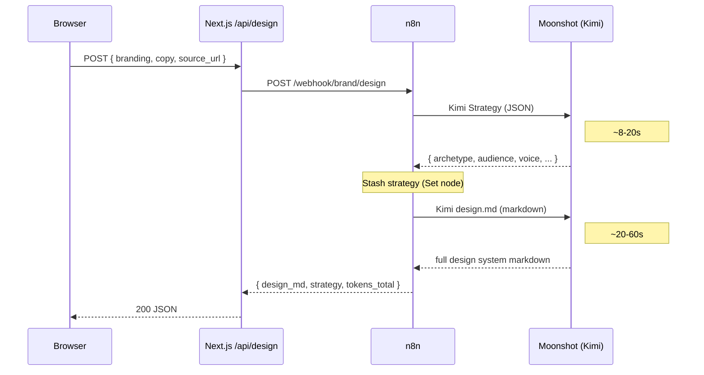
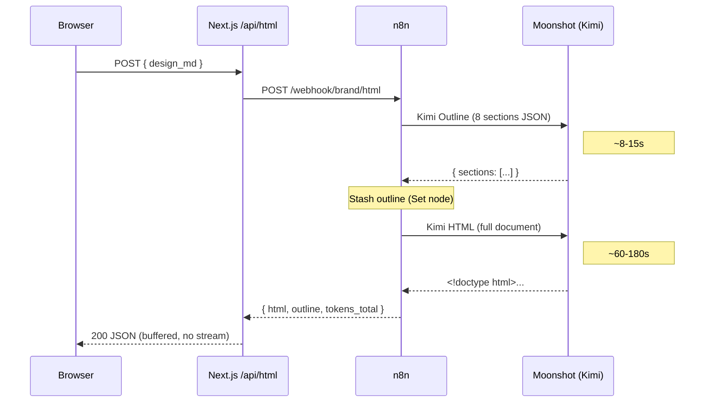
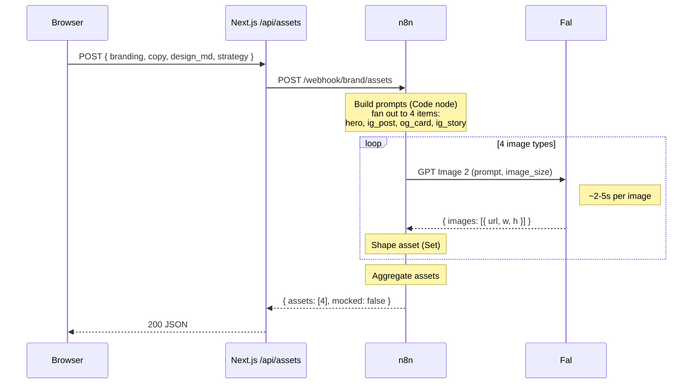

# Sequences

Per-route temporal flow for the four `brand/*` webhooks. The system flowchart in `ARCHITECTURE.md` shows topology - who talks to whom. These diagrams show order and timing - what blocks on what, where the waits live, and which calls dominate latency. Use them when reasoning about timeouts, retries, or where to add streaming.

## Decode

## Design

## HTML

## Assets

